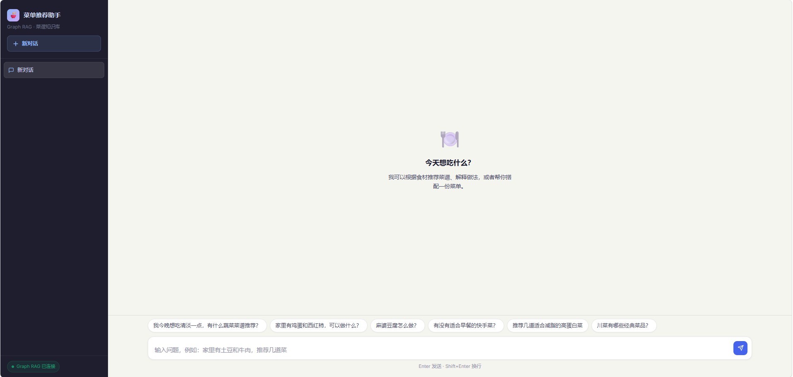

# 菜单推荐助手

菜单推荐助手是一个面向中文菜谱问答与推荐的 Graph RAG 项目，结合了 Neo4j、Milvus、混合检索、图谱检索和 React 聊天界面。它可以根据食材、口味和约束条件推荐菜品，解释菜谱做法，并支持导出聊天记录为 PDF。

## 首页界面



## 功能特点

- 基于 Neo4j 菜谱知识图谱的 Graph RAG 检索与问答。
- 结合关键词检索、向量检索和图谱检索的混合召回能力。
- 支持传统混合检索、图谱检索、组合检索之间的智能路由。
- 前端使用 React 构建，支持会话历史、本地存储、流式输出和 PDF 导出。
- 提供 Windows 一键启动脚本，方便本地开发与演示。

## 环境要求

- Docker Desktop，用于启动 Neo4j 和 Milvus。
- Python 3.10 及以上。
- Node.js 18 及以上，以及 npm。
- 可兼容 Moonshot 的大模型 API Key。

## 快速开始

1. 克隆项目并进入目录。

```powershell
git clone <your-repo-url>
cd Menu-Recommendation-Assistant
```

2. 创建本地环境变量文件。

```powershell
copy .env.example .env
```

然后编辑 `.env`，填入 `MOONSHOT_API_KEY`。

3. 首次启动建议执行：

```powershell
.\start.ps1 -InstallDeps
```

这个脚本会自动完成：

- 如果缺少 `.env`，则根据 `.env.example` 创建。
- 启动根目录 `docker-compose.yml` 中的 Milvus、etcd、MinIO。
- 启动 `data/docker-compose.yml` 中的 Neo4j。
- 在传入 `-InstallDeps` 时安装 Python 依赖。
- 启动后端服务 `http://127.0.0.1:8000`。
- 通过后端直接提供 `frontend/dist` 的构建产物。

后续日常启动可以直接执行：

```powershell
.\start.ps1
```

停止本地进程：

```powershell
.\stop.ps1
```

## 手动启动

项目刻意把两套 Docker Compose 分开，便于分别管理：

- `docker-compose.yml`：启动 Milvus、etcd、MinIO。
- `data/docker-compose.yml`：启动 Neo4j，并导入 `data/cypher` 下的图数据。

启动 Milvus：

```powershell
docker compose -f docker-compose.yml up -d
```

启动 Neo4j：

```powershell
docker compose -f data/docker-compose.yml up -d
```

启动后端：

```powershell
python -m venv .venv
.\.venv\Scripts\activate
pip install -r requirements.txt
python web_server.py
```

如果你想单独调试前端开发服务器：

```powershell
cd frontend
npm install
npm run dev
```

开发模式访问：

```text
http://127.0.0.1:5173
```

## 生产构建

先构建前端：

```powershell
cd frontend
npm install
npm run build
```

然后回到项目根目录启动：

```powershell
python web_server.py
```

此时后端会直接提供 `frontend/dist`，访问：

```text
http://127.0.0.1:8000
```

## 配置说明

大部分配置来自 `.env`，常用变量包括：

- `MOONSHOT_API_KEY`：调用大模型所必需。
- `MOONSHOT_API_BASE_URL`：默认值为 `https://api.moonshot.cn/v1`。
- `NEO4J_URI`、`NEO4J_USER`、`NEO4J_PASSWORD`、`NEO4J_DATABASE`。
- `MILVUS_HOST`、`MILVUS_PORT`、`MILVUS_COLLECTION_NAME`。
- `EMBEDDING_MODEL`、`LLM_MODEL`。
- `TOP_K`、`MAX_GRAPH_DEPTH`、`MAX_TOKENS`。

## 项目结构

- `rag_modules/`：数据准备、索引构建、检索、路由、生成等核心模块。
- `data/cypher/`：Neo4j 导入脚本与图谱 CSV 数据。
- `frontend/`：Vite + React 前端。
- `web_server.py`：轻量后端与前端静态资源服务。
- `start.ps1`、`start.bat`：一键启动脚本。
- `stop.ps1`、`stop.bat`：停止本地前后端进程。
- `docs/`：架构与部署相关说明。

## 使用提醒

- 不要提交 `.env`。
- 启动前请确保 Docker Desktop 已经运行。
- 首次运行可能较慢，因为需要准备 Python 包、前端依赖、向量索引和知识库。
- `volumes/` 目录包含 Docker 运行时数据，不应提交到版本库。
